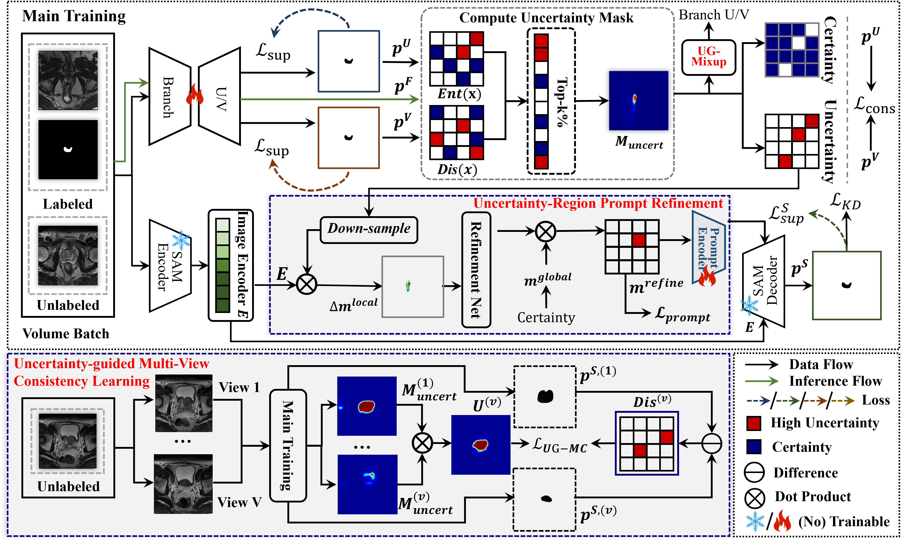

# TPL-SAM: Trustworthy Prompt Learning with SAM for Semi-Supervised Medical Image Segmentation

<p align="center">
  <a href="https://github.com/SIGMACX/TPL-SAM"></a>
  
  
  
</p>

Official implementation of **TPL-SAM**, a trustworthy prompt learning framework with the Segment Anything Model (SAM) for semi-supervised medical image segmentation.

> **Note**: The training code, pretrained checkpoints, and detailed reproduction scripts will be released soon.

## Abstract

Accurate medical image segmentation remains challenging under limited annotations because expert labeling is costly and anatomical structures are often ambiguous. Although the Segment Anything Model (SAM) provides strong promptable segmentation capability, its performance is highly sensitive to prompt quality, and unreliable prompts derived from noisy pseudo-labels can amplify errors in semi-supervised learning. To address this issue, we propose **TPL-SAM**, a trustworthy prompt learning framework for semi-supervised medical image segmentation. Specifically, TPL-SAM estimates unreliable regions by integrating prediction entropy and inter-branch discrepancy. First, the **Uncertainty-Region Prompt Refinement (URPR)** module refines mask prompts in high-uncertainty regions, guiding SAM to produce more reliable teacher predictions. Second, the **Uncertainty-Guided Multi-View Consistency Learning (UGMC)** module enforces cross-view agreement on uncertain regions of unlabeled images, thereby stabilizing pseudo-label learning while avoiding over-regularization in confident regions. In addition, an **Uncertainty-Guided MixUp** regularizer injects reliable supervision into hard patches to further improve generalization. Extensive experiments on multiple public medical image segmentation benchmarks show that TPL-SAM achieves competitive performance, with clear advantages under low-label and boundary-ambiguous settings.

## Main Figure

<p align="center">
  
</p>

<p align="center">
  <b>Overview of TPL-SAM.</b> The framework contains a lightweight dual-branch student network, a training-time SAM-assisted teacher, Uncertainty-Region Prompt Refinement (URPR), Uncertainty-Guided Multi-View Consistency Learning (UGMC), and Uncertainty-Guided MixUp.
</p>

## Highlights

- **Trustworthy prompt learning**: TPL-SAM explicitly models unreliable prompt regions instead of assuming pseudo-label-derived prompts are reliable.
- **URPR**: Refines mask prompts in high-uncertainty regions to improve the reliability of SAM-assisted teacher predictions.
- **UGMC**: Enforces cross-view consistency on uncertain regions of unlabeled images, stabilizing pseudo-label learning while preserving confident predictions.
- **UG-MixUp**: Injects reliable supervision into hard patches to improve generalization under limited annotation.
- **Efficient deployment**: SAM and prompt-refinement modules are used only during training. During inference, only the lightweight student prediction is used.

## Method Overview

TPL-SAM is designed for semi-supervised medical image segmentation with a small labeled set and a larger unlabeled set. The student network produces two branch predictions and a fused prediction. The framework then estimates unreliable regions by combining:

1. **Prediction entropy**, which reflects pixel-wise uncertainty of the fused prediction.
2. **Inter-branch discrepancy**, which captures disagreement between the two student branches.

The resulting composite uncertainty map is used in three places:

- **Prompt refinement**: URPR corrects high-uncertainty prompt regions before SAM generates teacher predictions.
- **Multi-view consistency**: UGMC aligns SAM-assisted teacher predictions across augmented views and applies consistency on uncertain regions.
- **Hard-region regularization**: UG-MixUp strengthens supervision on difficult patches selected by uncertainty.

## Prompt-Noise Robustness Protocol

The following prompt perturbation protocol is used to evaluate the robustness of the training-time SAM teacher under degraded prompts. Level 0 denotes clean prompts, while Level 4 denotes severe prompt noise.

| Level | Box shift | Mask erosion | Mask dilation | Coarse mask | Interpretation |
|---:|---|---|---|---|---|
| 0 | Clean GT box; 0 px shift | Clean 64×64 GT mask prompt; radius 0 | Clean 64×64 GT mask prompt; radius 0 | Clean 64×64 GT mask prompt | Clean prompt baseline |
| 1 | Box shift up to ±4 px; corner jitter up to ±2 px | Erosion radius 1 on 64×64 mask prompt | Dilation radius 1 on 64×64 mask prompt | Downsample to 48×48, then upsample to 64×64 | Mild prompt noise |
| 2 | Box shift up to ±8 px; corner jitter up to ±4 px | Erosion radius 2 on 64×64 mask prompt | Dilation radius 2 on 64×64 mask prompt | Downsample to 32×32, then upsample to 64×64 | Moderate prompt noise |
| 3 | Box shift up to ±16 px; corner jitter up to ±8 px | Erosion radius 4 on 64×64 mask prompt | Dilation radius 4 on 64×64 mask prompt | Downsample to 16×16, then upsample to 64×64 | Strong prompt noise |
| 4 | Box shift up to ±32 px; corner jitter up to ±16 px | Erosion radius 8 on 64×64 mask prompt | Dilation radius 8 on 64×64 mask prompt | Downsample to 8×8, then upsample to 64×64 | Severe prompt noise |

## Datasets

TPL-SAM is evaluated on multiple public medical image segmentation benchmarks, including:

- **Colonoscopy polyp segmentation**: CVC-300, CVC-ColonDB, ETIS, and Kvasir.
- **Dermoscopic lesion segmentation**: ISIC2018.
- **Prostate MRI segmentation**: PROMISE12.


## Citation

If you find this work useful, please consider citing:

```bibtex
@article{chen2026tplsam,
  title   = {TPL-SAM: Trustworthy Prompt Learning with SAM for Semi-Supervised Medical Image Segmentation},
  author  = {Chen, Xi and Tong, Lyuyang and Hu, Min and Du, Bo},
  journal = {},
  year    = {2026}
}
```

## Acknowledgement

This project builds on the Segment Anything Model and semi-supervised medical image segmentation research. We thank the maintainers of public medical segmentation benchmarks for supporting reproducible research.

## Contact

For questions, please open an issue or contact the authors through the project page:

- GitHub: https://github.com/SIGMACX/TPL-SAM
